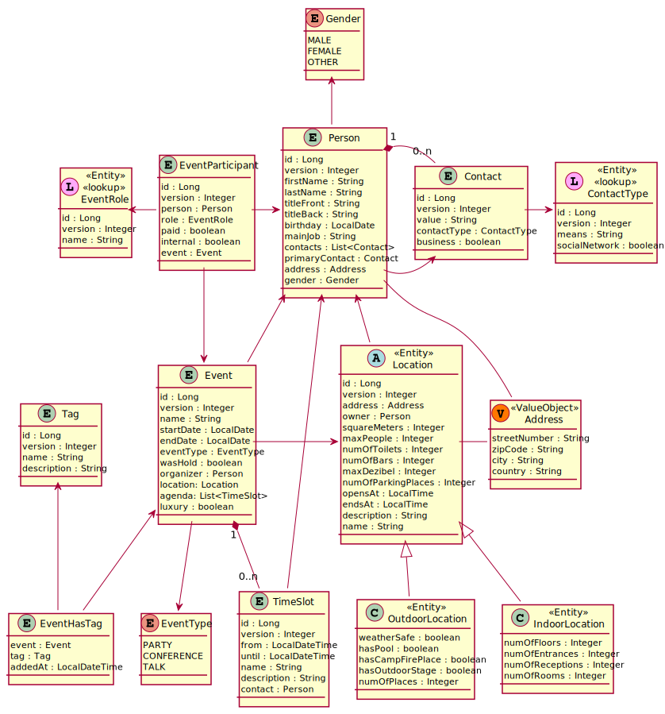

# Event Manager 2021
> Provides functionality to organize visitors, catering, speakers, and locations

# Build
Build with Maven (pom.xml)

# Technology
- Spring Boot
- Spring Web
- Thymeleaf
- Validation
- Spring Devtools
- Maven
- Lombok
- Data JPA
- Plant UML
- Spring Starter Tests

# Git Flow
- **Development:** development
- **Features:** feature/...

# Domain Model

# Contributors
- Moritz Mitterdofer (mit19629@spengergasse.at)
- Florian Flatscher (fla19488@spegergasse.at)
